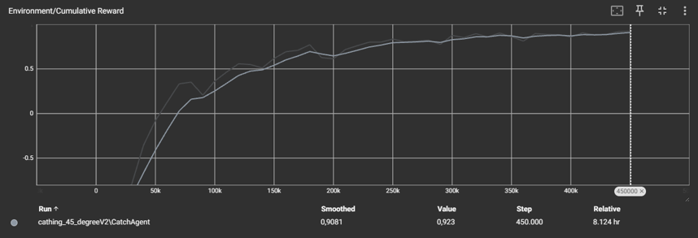
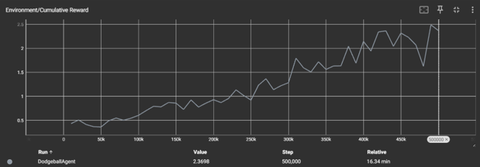
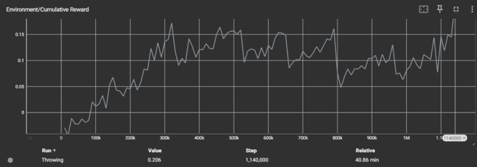

# VR-experience-trefbal — Tutorial

## Inleiding

In dit project bouwen we een VR-trefbalspel waarin de menselijke speler het opneemt tegen een
AI-tegenstander die reageert via ML-Agents. De speler gooit ballen vanuit een VR-headset; de AI
beslist autonoom wanneer hij ontwijkt, vangt of gooit op basis van drie afzonderlijk getrainde
modellen die runtime wisselen via een BrainSwitcher-systeem.

Deze tutorial legt uit hoe je het volledige project van nul opbouwt: van scène-opbouw en
physics-configuratie tot het trainen van de drie agents en het integreren ervan in de VR-omgeving.
Tegen het einde beschik je over een speelbare VR-scène met een volledig functionerende
AI-tegenstander.

---

## Methoden

### Verloop van het spel

De AI-tegenstander bestaat uit drie afzonderlijke brains — `dodge`, `catch` en `throw` — die
worden beheerd door het `BrainSwitcher`-script op een centrale Manager-GameObject. Elk brain is
een apart getraind ML-Agents-model met een eigen Agent-component, eigen support-objecten
(ballspawner, target, …) en eigen `.onnx`-bestand.

**Opstartfase**

Bij het laden van de scène initialiseert `BrainSwitcher` alle drie de Agent-componenten tegelijk
gedurende twee frames. Dit zorgt dat elke Agent zijn `LazyInitialize` en `InitializeSensors`
doorloopt terwijl de Academy-eventloop nog nauwelijks callbacks doet. Na de warm-up wordt
standaard het dodge-brain geactiveerd.

**Brain switching**

De drie Agent-GameObjects blijven permanent `SetActive(true)`. Alleen de `Agent`-component zelf
wordt via `.enabled` aan- en uitgezet — nooit het GameObject. Dit voorkomt een
`NullReferenceException` in `UpdateSensors` die optrad wanneer `SetActive(false/true)` de
`RayPerceptionSensorComponent` door zijn lifecycle stuurde zonder `CreateSensors()` opnieuw aan
te roepen.

Wisselen kan op twee manieren:

- **Manueel (POC/debug):** toetsen `1`, `2`, `3` activeren respectievelijk dodge, catch en throw.
- **Automatisch:** andere scripts roepen `BrainSwitcher.SwitchToBrain("catch")` aan op basis van
  spellogica (bijvoorbeeld wanneer een bal gedetecteerd wordt).

Bij elke wissel wordt de positie en rotatie van de vorige actieve agent overgedragen aan de
nieuwe, zodat er geen visuele sprong ontstaat. Support-objecten (ballspawner, target, …) worden
via gewone `SetActive`-calls meegeschakeld.

**Spelverloop stap voor stap**

1. De VR-speler staat aan één kant van het speelveld; de AI-agent aan de andere kant.
2. De speler gooit een bal richting de AI.
3. Het BrainSwitcher-script detecteert de situatie en activeert het correcte brain.
4. De agent beslist autonoom: ontwijken, vangen of terugwerpen.
5. Een bal die de speler raakt, geeft de AI een punt; een bal die de AI raakt, geeft de speler
   een punt. Het scorebord (TextMeshPro) wordt live bijgewerkt.

---

### Objecten in de scène

| Object | Component(en) | Rol |
|---|---|---|
| `Ball` | Rigidbody, Sphere Collider, tag `Ball` | Vliegende bal met physics |
| `BallSpawner` | Script `BallSpawner` | Spawnt ballen op willekeurige X-positie |
| `BallSpawner > VisualCube` | MeshRenderer (**geen** Box Collider) | Visuele helper, collider uitgeschakeld |
| `DodgeAgent` | `DodgeAgent`-script, Capsule Collider | Brain 1 — ontwijken |
| `CatchAgent` | `CatchingAgent`-script, `RayPerceptionSensor`, Capsule Collider | Brain 2 — vangen |
| `ThrowAgent` | `ThrowAgent`-script, Capsule Collider | Brain 3 — gooien |
| `Manager` | `BrainSwitcher`-script | Beheert welk brain actief is |
| `XR Origin` | XR Interaction Manager, diverse XR-componenten | VR-speler |
| `XR Origin > PlayerHitbox` | Capsule Collider, Rigidbody (kinematic), tag `Player` | Collision-detectie voor de speler |
| `ScoreManager` | Script `ScoreManager` | Houdt score bij voor speler en AI |
| `ScoreboardCanvas` | TextMeshPro-elementen | Toont score in de scène |

> **Belangrijk:** de Box Collider op de visuele `VisualCube` van de BallSpawner **moet uitstaan**.
> Als hij aan staat, botst de gespawnde bal direct met de cube en vliegt willekeurig opzij.

---

### Gedragingen van de objecten

#### Ball

- Krijgt bij spawn een `AddForce` richting de agent.
- Roept in `OnCollisionEnter` de `ScoreManager` aan op basis van de tag van het geraakte object.
- Wordt **niet** vernietigd bij een collision; alleen na een timer of bij het verlaten van het
  speelveld.

```csharp
void OnCollisionEnter(Collision collision)
{
    if (collision.gameObject.CompareTag("Player"))
        ScoreManager.Instance.AddAIPoint();
    else if (collision.gameObject.CompareTag("Agent"))
        ScoreManager.Instance.AddPlayerPoint();
}
```

#### PlayerHitbox

- Volgt elke frame de horizontale positie van de XR Main Camera, zodat de hitbox meeverplaatst
  met de fysieke beweging van de speler.

```csharp
void Update()
{
    Vector3 cam = xrCamera.position;
    transform.position = new Vector3(cam.x, transform.position.y, cam.z);
}
```

#### BrainSwitcher

- Alle drie de Agent-GameObjects staan permanent actief; enkel `Agent.enabled` wordt getoggeld.
- Bij het inschakelen van een agent triggert Unity automatisch
  `OnEnable → LazyInitialize → OnEpisodeBegin`, zodat de nieuwe brain meteen een schone episode
  start.
- Renderers en Colliders worden mee getoggeld zodat alleen de actieve brain visueel en fysiek
  aanwezig is; dit voorkomt dat een bal de inactieve agent raakt en een ongewenste episode start.

```csharp
brainSwitcher.SwitchToBrain("catch");  // activeert catching-brain
brainSwitcher.SwitchToBrain("dodge");  // activeert dodge-brain
brainSwitcher.SwitchToBrain("throw");  // activeert throw-brain
```

---

### Observaties, acties en beloningen — Catching AI

#### Observaties

| Sensor | Wat wordt waargenomen |
|---|---|
| `RayPerceptionSensor` | Ballen, richting, afstand via raycasts |
| Vector observations | Minimaal gehouden; rays bevatten vrijwel alle benodigde info |

#### Acties (discrete)

| Branch | Waarde | Actie |
|---|---|---|
| Branch 1 — Rotatie | 0 | Kijk links (−45°) |
| Branch 1 — Rotatie | 1 | Kijk midden (0°) |
| Branch 1 — Rotatie | 2 | Kijk rechts (+45°) |
| Branch 2 — Catch | 0 | Niet vangen |
| Branch 2 — Catch | 1 | Vangpoging uitvoeren |

#### Beloningen

| Gebeurtenis | Reward | Reden |
|---|---|---|
| Bal succesvol gevangen | +1.0 | Hoofddoelstelling |
| Bal raakt agent zonder catch | −1.0 | Vermijd geraakt worden |
| Harde impact | −1.0 | Vermijd harde botsing |
| Catch-poging (elke poging) | −0.02 | Voorkomt catch-spam |
| Rotatiewissel | −0.001 | Voorkomt trillen tussen richtingen |

---

### Observaties, acties en beloningen — Dodge AI

#### Observaties

| Observatie | Type | Toelichting |
|---|---|---|
| Relatieve balpositie | Vector3 | `bal_pos − agent_pos` i.p.v. absolute coördinaten |
| Balsnelheid | Vector3 | Richting en snelheid van de inkomende bal |
| Bal bestaat | bool (float) | Flag die aangeeft of er een actieve bal in de scène is |
| Raycasts | RayPerceptionSensor | Detecteert objecten rondom de agent |

> **Les:** absolute coördinaten dwingen het netwerk om afstand zelf te berekenen. Relatieve
> observaties versnelden het leerproces van vluchtgedrag aanzienlijk.

#### Acties (continue)

De agent beschikt over continue bewegingsacties langs de X- en Z-as binnen zijn eigen helft van
het speelveld.

#### Beloningen

| Gebeurtenis | Reward | Reden |
|---|---|---|
| Elke tijdstap overleven | +0.01 | Stimuleert actief ontwijken |
| Geraakt door bal | −1.0 | Hoofdstraf |

---

### Observaties, acties en beloningen — Throw AI

#### Observaties

12 float-observaties, waaronder:

| Observatie | Toelichting |
|---|---|
| Hoek naar doel (sin/cos) | Geeft de richting naar het doel nauwkeuriger weer dan een enkele hoekwaarde |
| Eigen positie en snelheid | Positiebepaling in het speelveld |
| Doelpositie (relatief) | Afstand en richting tot het doelwit |

#### Acties (continue + trigger)

| Actie | Type | Omschrijving |
|---|---|---|
| Bewegen X/Z | Continu | Verplaatsing over het speelveld |
| Mikrichting | Continu | Horizontale richting van de worp |
| Gooihoek | Continu | Verticale hoek van de worp |
| Gooikracht | Continu | Kracht waarmee de bal losgelaten wordt |
| Loslaten | Trigger | Voert de worp effectief uit |

#### Aanpak: curriculum learning

Het doel wordt stap voor stap moeilijker gemaakt: verder weg, kleiner en sneller. Dit verdeelt
het leerprobleem in beheersbare deelproblemen.

| Lesson | Doel |
|---|---|
| 0 | Doel op 4 m, groot en stil |
| 1–4 | Doel stap voor stap verder, kleiner en sneller |
| 5 | Finaal gedrag tegen bewegend doelwit |

#### Beloningen

| Gebeurtenis | Reward | Reden |
|---|---|---|
| Doel geraakt | +1.0 | Hoofddoelstelling |
| Bal mist het veld | −0.5 | Vermijd onnodige worpen |
| Elke tijdstap | klein negatief | Stimuleert efficiënte worp |

---

### Trainingsverloop catching-model

Het model doorliep tien ontwikkelfasen:

| Fase | Aanpak | Resultaat |
|---|---|---|
| 1 | Enkel timing, 1 spawnpunt | Agent leert vangmoment |
| 2–3 | Smooth (continue) rotatie | Agent kijkt naar één kant, volgt bal niet |
| 4 | Terug naar enkel timing | Bevestigt: probleem zit in rotatie |
| 5 | Snap rotation (−45°/0°/+45°) | Sterke verbetering, consistente keuzes |
| 6 | Snap rotation + 2 spawnpunten | Eerste bruikbare versie |
| 7 | Snap rotation + 3 spawnpunten | Actieve richtingsbeslissing |
| 8 | RayPerceptionSensor toegevoegd | Betere generalisatie |
| 9 | Catch-spam reward geoptimaliseerd (−0.02) | Belangrijkste verbetering van het project |
| 10 | Zelfde model, willekeurige X-spawnpositie | Betere generalisatie naar nieuwe situaties |

---

### Trainingsverloop dodge-model

| Versie | Aanpak / wijziging | Resultaat |
|---|---|---|
| Eerste setup | Enkel eigen positie als observatie | Agent leerde niets |
| Werkende basis | Balpositie + snelheid + flag toegevoegd | Eerste werkende training |
| v5 | Baseline | Mean Reward +0.477, maar agent loopt altijd naar linkermuur — lokaal optimum |
| v8 | Survival reward 0.005→0.01, Decision Period 5→3 | Doorbraak: positieve reward vanaf stap 10k |
| v12 | Agent op eigen helft, raycasts, spawn uit 3 richtingen, 4 arena's tegelijk | Mean Reward +2.37 op 500k steps |

---

### Trainingsverloop throw-model

| Versie | Aanpak / wijziging | Resultaat |
|---|---|---|
| v1 | Initiële setup | Reward bleef hangen op −0.4, geen exploratie |
| v2 | Curriculum geïntroduceerd | Lesson 0 (doel op 4m) geslaagd, vastgelopen op lesson 1 |
| v3 | Volledige curriculum (lesson 0–5, ~1M steps) | Doorliep alle lessons, reward vlak rond 0.1 |

> **Bewust imperfect:** de throw-agent mikt correct op dichtbijgelegen doelen en mist verder weg.
> Dit is een bewuste keuze: een throw die altijd raak is, maakt het spel kapot voor de speler.

---

## Resultaten

### Catching AI — Tensorboard



---

### Dodge AI — Tensorboard



---

### Throw AI — Tensorboard



---

### Opvallende waarnemingen

- **Catch-spam** was de meest impactvolle bug: zonder strafpunt voor elke poging voerde de
  agent onophoudelijk vangacties uit. Een kleine negatieve reward (−0.02) loste dit volledig op.
- **Continue rotatie** bleek ongeschikt voor de catch-taak; de vereenvoudiging naar drie
  snap-posities zorgde voor een onmiddellijke doorbraak.
- **Absolute vs. relatieve observaties** (dodge-model): het doorgeven van de relatieve
  balpositie versnelde het leerproces van vluchtgedrag aanzienlijk.
- **Cijfers zijn niet gelijk aan goed gedrag:** dodge v5 behaalde een positieve Mean Reward,
  maar vertoonde ongewenst muurgedrag. Visuele inspectie van het gedrag is minstens even
  belangrijk als de trainingsgrafieken.
- **Curriculum learning** (throw-model): het opdelen van het leerprobleem in stapsgewijze
  moeilijkheidsgraden was noodzakelijk om überhaupt exploratie te verkrijgen.

---

## Conclusie

We ontwikkelden een VR-trefbalervaring waarin een menselijke speler het opneemt tegen een
ML-Agents-gebaseerde AI die autonoom wisselt tussen drie getrainde brains via een
BrainSwitcher-systeem.

Het catching-model bereikt na tien iteraties een stabiele Mean Reward boven +0.90 en vertoont
correct getimed vanggedrag vanuit willekeurige invalshoeken. Het dodge-model evolueerde van een
agent die uitsluitend naar de muur liep naar reactief ontwijkgedrag via betere observaties en
reward-balans. Het throw-model doorliep een volledig curriculum en levert bewust imperfect
gooi-gedrag om de spelbalans te bewaren.

De resultaten tonen dat gerichte beloningsstructuur — met name kleine strafpunten voor ongewenst
repetitief gedrag en de keuze voor relatieve observaties — een grotere impact heeft dan
architectuurkeuzes alleen. Het modulaire BrainSwitcher-systeem maakt het mogelijk om drie
gespecialiseerde modellen samen te laten werken zonder de complexiteit van één monolithisch model.
Voor toekomstige versies liggen kansen in meer kijkrichtingen voor de catch-agent, verticale
baldetectie, adaptieve moeilijkheidsgraad en training tegen menselijke spelers in plaats van
gesimuleerde spawnpunten.

---
